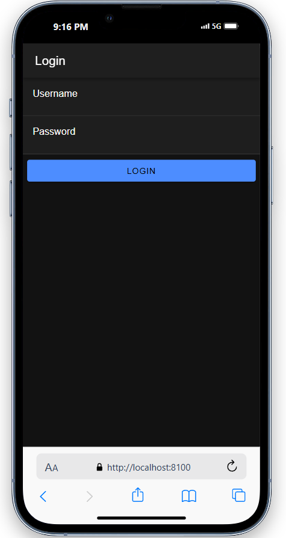

# Tahta Setyo Nugroho
# H1D022066

# Pengisian Form Login:
 Pengguna memasukkan username dan password, kemudian menekan tombol login.
# Validasi Login:
 Aplikasi mengirim data login (username dan password) ke server menggunakan metode post Server kemudian memverifikasi kredensial dan, jika valid, mengirimkan status login beserta token autentikasi.
# Penyimpanan Data:
 Jika login berhasil, token dan username disimpan di storage lokal menggunakan Capacitor Preferences, dan status `isAuthenticated` diubah menjadi `true` sebagai tanda autentikasi sukses.
# Navigasi ke Halaman Utama:
 Setelah login sukses, pengguna secara otomatis diarahkan ke halaman utama (home).
# Akses Pengguna yang Belum Login:
 Jika pengguna mencoba mengakses halaman yang memerlukan autentikasi tanpa login, `authGuard` akan mengarahkan mereka kembali ke halaman login.
# Logout:
 Saat pengguna memilih logout, `AuthenticationService` menghapus data login (token dan username) dari storage, mengatur ulang `isAuthenticated` menjadi `false`, dan mengarahkan pengguna ke halaman login.
# AutoLogin:
 Jika pengguna sudah login sebelumnya, `autoLoginGuard` memungkinkan mereka langsung diarahkan ke halaman utama tanpa perlu login ulang.

 
 